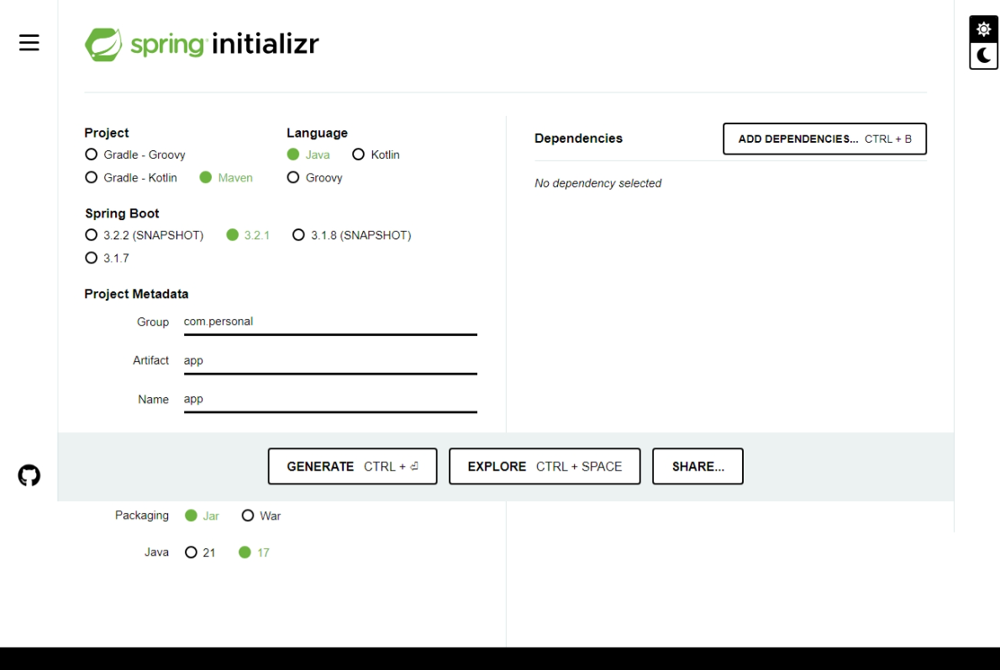

# Curso básico de Spring Boot, con buenas prácticas.

[[_TOC_]]


# ¿Que es Spring Boot, y que es Spring Framework?

## Spring Boot 🍃.

Spring Boot es un marco de desarrollo de aplicaciones en Java basado en el framework Spring. Nos proporciona una forma rápida y sencilla de crear aplicaciones Java con una configuración mínima.

Una de las principales características de Spring Boot es su enfoque en la convención sobre la configuración. Esto significa que muchas de las configuraciones necesarias para una aplicación, Spring se pueden establecer automáticamente, lo que nos permite como desarrolladores es en enfocarse en la lógica de negocio en lugar de una configuración detallada.

Además, Spring Boot incluye un servidor web integrado, lo que significa que no es necesario configurar y desplegar una aplicación en un servidor web externo. Esto nos facilita el desarrollo y la ejecución de aplicaciones web de forma rápida y sencilla.

Spring Boot también ofrece una amplia gama de características y funcionalidades para el desarrollo de aplicaciones empresariales, como la integración con bases de datos, la seguridad, la gestión de transacciones y la creación de servicios web.

En resumen, Spring Boot es un marco de desarrollo de aplicaciones Java que simplifica la configuración y el desarrollo de aplicaciones empresariales, que nos permite centrarnos en la lógica de negocio y la funcionalidad de la aplicación.

## Spring Framework 🖼️.

Spring Framework es un framework de desarrollo de aplicaciones Java que proporciona una infraestructura integral y modular para desarrollar aplicaciones empresariales. Es conocido por su enfoque basado en componentes, su facilidad de uso y su capacidad de integración con otras tecnologías.

El objetivo principal de Spring Framework es simplificar el desarrollo de aplicaciones Java al proporcionar una abstracción de alto nivel sobre las APIs de Java, lo que facilita la implementación de patrones de diseño y buenas prácticas de programación. Además, Spring Framework ofrece características como la inversión de control (IoC) y la inyección de dependencias (DI), que ayudan a reducir la dependencia entre los componentes de la aplicación y promueven la reutilización del código.

Spring Framework también incluye módulos para diferentes aspectos de desarrollo, como el acceso a bases de datos, la seguridad, el manejo de transacciones y la creación de servicios web. Estos módulos se pueden utilizar de forma independiente o combinados según las necesidades del proyecto.

En resumen, Spring Framework es un framework completo y flexible que simplifica el desarrollo de aplicaciones Java al proporcionar una infraestructura modular, características de alto nivel y una amplia integración con otras tecnologías.

## Comparación ☕.

| Aspecto | Spring Boot | Spring Framework |
| --- | --- | --- |
| Configuración. | Requiere configuración mínima debido a su enfoque en la convención sobre la configuración. | Requiere configuración detallada y manual. |
| Despliegue | Incluye un servidor web integrado, lo que facilita el desarrollo y la ejecución de aplicaciones web. | Requiere configurar y desplegar la aplicación en un servidor web externo. |
| Desarrollo de aplicaciones empresariales. | Ofrece una amplia gama de características y funcionalidades para el desarrollo de aplicaciones empresariales, como integración con bases de datos, seguridad, gestión de transacciones y creación de servicios web. | También ofrece características para el desarrollo de aplicaciones empresariales, pero requiere configuración manual y uso de módulos adicionales. |
| Enfoque | Se centra en simplificar la configuración y el desarrollo de aplicaciones Java, permitiendo a los desarrolladores centrarse en la lógica de negocio y la funcionalidad de la aplicación. | Se enfoca en proporcionar una infraestructura integral y modular para el desarrollo de aplicaciones Java, promoviendo buenas prácticas de programación y reutilización del código. |
| Uso de anotaciones | Utiliza anotaciones para configurar y definir componentes, controladores, rutas, entre otros. | También utiliza anotaciones, pero requiere más configuración manual en comparación con Spring Boot. |
| Facilidad de uso | Proporciona una forma rápida y sencilla de crear aplicaciones Java con configuración mínima. | Requiere más configuración y conocimiento técnico para su implementación. |


[⬆ Volver](https://github.com/AlexNarvaez00/Spring-Boot-Blog?tab=readme-ov-file#curso-b%C3%A1sico-de-spring-boot-con-buenas-pr%C3%A1cticas)

# Requerimientos 📃.

Un proyecto de Spring Boot, necesitan algunas cosas. En este caso, utilizaremos Maven como gestor de dependencias, aunque existen otros gestores de dependencias como Gradle.

## Instalación de Java (20) 🍵.

La descarga de Java en su versión 20 la puedes realizar desde la siguiente [página](https://www.oracle.com/java/technologies/javase/jdk20-archive-downloads.html) 📎, recuerda elegir correctamente tu sistemas Operativo.

- Instalación Linux (Ubuntu).
    
    ```bash
    #El nombre puede variar
    sudo dpkg -i jdk-20.0.2_linux-x64_bin.deb
    ```
    
    Puede que al momento de ejecutar el comando `java —version` nos indique que no esta instalado, para dar solución a este problema, debes de ingresar los siguiente comandos.
    
    ```bash
    # Primer Comando.
    sudo update-alternatives --install /usr/bin/java java /usr/lib/jvm/jdk-20/bin/java 1
    # Segundo Comando.
    udo update-alternatives --install /usr/bin/javac javac /usr/lib/jvm/jdk-20/bin/javac 1
    #Terc
    sudo update-alternatives --install /usr/bin/jar jar /usr/lib/jvm/jdk-20/bin/jar 1er comando.
    ```
    
    Recuerda que debes de cambiar `jdk-20` por la versión que hayas instalado de Java.
    

## Instalación de Maven ⬇️.

Puedes descargar esta herramienta desde la página oficial. Te recomiendo que descargues la última versión disponible, ya que también estamos trabajando con la última versión de Java.

```bash
# Descarga, recuerda que puede cambiar.
wget https://dlcdn.apache.org/maven/maven-3/3.8.8/binaries/apache-maven-3.8.8-bin.tar.gz
```

Ejecuta el siguiente comando para extraer los recursos en la ruta `/opt`.

```bash
sudo tar xzf apache-maven-3.8.8-bin.tar.gz -C /opt
```

Después, navega a la carpeta `/opt` y cambia el nombre de la carpeta. Este paso es necesario, ya que más adelante utilizaremos esa ruta.

```bash
sudo mv apache-maven-3.8.8/ maven/
```

Luego, ve a la siguiente ruta.

```bash
cd /etc/profile.d/
```

Crea el siguiente archivo.

```bash
touch maven.sh
```

Ingresa las siguientes líneas dentro del mismo archivo.

```bash
export M2_HOME=/opt/maven
export PATH=${M2_HOME}/bin:${PATH}
```

[⬆ Volver](https://github.com/AlexNarvaez00/Spring-Boot-Blog?tab=readme-ov-file#curso-b%C3%A1sico-de-spring-boot-con-buenas-pr%C3%A1cticas)

# Creación de un Proyecto 🏭.

Crear un proyecto de Spring Boot, es tan sencillo como ingresar a su [sitio oficial](https://start.spring.io/), recuerda que debes de seleccionar Maven y la versión de Java correspondiente.



## Dependencias necesarias para Spring Boot 🐀.

- Uso de la página de init.
    
    Debes de dar clic en el botón de `add dependencies`.
    
- Dependencias necesarias.
    
    Las dependencias que debes agregar para iniciar un proyecto de Spring Boot son:
    
    - **Spring Web**: Esta dependencia proporciona las funcionalidades necesarias para crear aplicaciones web con Spring.
    - **Lombok**: Lombok es una biblioteca que ayuda a reducir la cantidad de código repetitivo en las clases Java, proporcionando anotaciones que generan automáticamente métodos y constructores.
    - **Spring Boot DevTools**: Esta dependencia ofrece herramientas para facilitar el desarrollo y la configuración de aplicaciones Spring Boot.
    - **Validación**: Esta dependencia permite realizar validaciones de datos de manera sencilla y consistente en las aplicaciones.
    - **Spring Data JPA**: Spring Data JPA simplifica el acceso y la manipulación de los datos en la base de datos utilizando el patrón de acceso a datos Object-Relational Mapping (ORM).
    
    Estas dependencias son esenciales para iniciar un proyecto de Spring Boot y aprovechar al máximo las características y funcionalidades que ofrece el framework.    
     
[⬆ Volver](https://github.com/AlexNarvaez00/Spring-Boot-Blog?tab=readme-ov-file#curso-b%C3%A1sico-de-spring-boot-con-buenas-pr%C3%A1cticas)


# Editores ⌨️.


Puedes utilizar el editor que más te guste. Algunos buenos editores para programar en Java son Eclipse y Visual Studio Code, junto con las extensiones específicas para este lenguaje.

Aquí te presento una lista de algunos editores que son recomendados por su funcionalidad y facilidad de uso:

- **Neovim:** Un editor de texto muy versátil que cuenta con numerosas características y plugins que te ayudarán a mejorar tu experiencia de programación.
- **Eclipse:** Un entorno de desarrollo integrado (IDE) muy popular para programar en Java. Proporciona herramientas poderosas para crear y depurar aplicaciones Java.
- **Visual Studio Code:** Un editor de código ligero y altamente personalizable. Es compatible con una amplia gama de lenguajes de programación y tiene una gran cantidad de extensiones disponibles para facilitar el desarrollo en Java.

Así que no dudes en probar estos editores y elegir el que mejor se adapte a tus necesidades y preferencias.

[⬆ Volver](https://github.com/AlexNarvaez00/Spring-Boot-Blog?tab=readme-ov-file#curso-b%C3%A1sico-de-spring-boot-con-buenas-pr%C3%A1cticas)

# Ejecución de nuestro proyecto Spring Boot 🚀.

## Edición del archivo de configuración ⚙️.

Antes de ejecutar el proyecto, debemos buscar el archivo de configuración de Spring Boot llamado `application.properties`. Una vez que hayamos encontrado dicho archivo, debemos cambiar su extensión a `yml`.


Posteriormente, necesitamos agregar las siguientes líneas al archivo `application.yml`. No te preocupes si aún no entiendes lo que estamos configurando, más adelante profundizaremos en el tema.

```yaml
# Configuracion básica de la conexión a una base
# de datos. 
spring:
	datasource: 
		url: jdbc:h2:men:MyDB
		username: sa
		driverClassName: org.h2.Driver
```

## Desde la terminal 🖥️.

Ejecutar nuestro proyecto Spring Boot desde la terminal, es tan sencillo como situarnos en la carpeta raíz de nuestro proyecto e ingresar el siguiente comando, debes de tener en cuenta que la primera ejecución puede tardar unos minutos ya que es necesario descargar todas las dependencias.

```bash
mvn spring-boot:run
```


Una vez ejecutada nuestra aplicación, podemos ingresar desde el navegador con la siguiente URL [**localhost:8080](http://localhost:8080/).**

- Errores al ejecutar y sus soluciones.

Unos de los errores más comunes al iniciar un proyecto de Spring Boot, es el error de la URL, dicho error ocurre cuando no hemos especificado la URL de la conexión de bases de datos, dicho error se soluciona con el primer paso de este apartado.

Otro de los errores mas comunes es que nuestra aplicación de Spring Boot no inicie, debido a que nuestra versión de java instalada, es una versión menor que la versión utilizada es nuestro proyecto, esto lo puede verificar el archivo `pom.xml`.

```xml
<?xml version="1.0" encoding="UTF-8"?>
<project xmlns="...." xmlns:xsi="...."
	xsi:schemaLocation="....">
	....
	<groupId>com.personal</groupId>
	<artifactId>app</artifactId>
	<version>0.0.1-SNAPSHOT</version>
	<name>app</name>
	<description>My firts proyect</description>
	<properties>
		<java.version>17</java.version>
	</properties>
	<dependencies>
		...
	</dependencies>

	<build>
		<plugins>
			...
		</plugins>
	</build>

</project>
```

[⬆ Volver](https://github.com/AlexNarvaez00/Spring-Boot-Blog?tab=readme-ov-file#curso-b%C3%A1sico-de-spring-boot-con-buenas-pr%C3%A1cticas)

# Anotaciones ✍🏻.

## ¿Que son las anotaciones?

En Java, las anotaciones son etiquetas especiales que se colocan encima de clases, métodos o campos para proporcionar información adicional sobre ellos. Son como notas que le da al compilador o al entorno de ejecución para que sepa cómo manejar ciertas partes de tu código.

## ¿Donde se utilizan?

Las anotaciones de Java se pueden utilizar en los siguientes lugares.

- **Encima de una Clase:** Se define el propósito general de la clase.
    
    ```java
    @RestController("persons")
    public class PersonController{ 
    ...
    }
    ```
    
- **Encima de métodos:** Especifica cómo debe comportarse un método en particular.
    
    ```java
    @RestController("persons")
    public class PersonController{ 
    	@RequestMapping("")
    	public String index(){
    		...
    	}
    }
    ```
    
- **Encima de campos:** Proporciona información sobre cómo se debe manejar un campo.
    
    ```java
    @RestController("persons")
    public class PersonController{
    	@Autowired
    	private MyService service; 
    	...
    }
    ```
    
- **Al lado de parámetros:** Define cómo se deben tratar los parámetros de un método.
    
    ```java
    
    @RestController("persons")
    public class PersonController{ 
    	@RequestMapping("")
    	public String index(@RequestParam("name") String name){
    		...
    	}
    }
    
    ```
    

Las anotaciones en Spring Boot son esenciales porque simplifican la configuración y el desarrollo de aplicaciones. Permitiendo a Spring Boot encargarse de muchos aspectos, como la gestión de dependencias, la configuración de componentes y la creación de instancias de clases de manera automática.

En resumen,  las anotaciones en Java, especialmente en Spring Boot, te permiten etiquetar tu código de manera especial para que el framework pueda entender y gestionar mejor tu aplicación. Hacen que el desarrollo sea más rápido, fácil de entender y menos propenso a errores. 

¡Es como darle a tu código un conjunto de instrucciones para que Spring Boot lo maneje de la mejor manera posible!

¡No te preocupes si no entendiste los ejemplos mostrados, son solo eso EJEMPLOS! Más adelante se explicara su funcionamiento a detalle, lo que es importante es que  entiendas el posicionamiento de las anotaciones.

[⬆ Volver](https://github.com/AlexNarvaez00/Spring-Boot-Blog?tab=readme-ov-file#curso-b%C3%A1sico-de-spring-boot-con-buenas-pr%C3%A1cticas)

# Lombok 🌶️.

Lombok es una biblioteca que simplifica la creación de clases y reduce la cantidad de código que necesita escribir. Su objetivo es hacer tu vida como desarrollador más fácil y tu código más limpio.

En Spring Boot, Lombok es como un superpoder ya que ayuda a simplificar la creación de entidades, servicios y otros componentes. Te permite reducir el código boilerplate (ese código repetitivo que no agrega mucha lógica) y concentrarte en lo que realmente importa.

## Utilidades y ventajas ♟️.

- **Menos código, más claro:** Lombok elimina la necesidad de escribir getters y setters, constructores y otros métodos comunes. ¡Menos código significa más claridad y menos posibilidades de errores!.
    
    ```java
    @Getter 
    @Setter
    public class Person{
    	private String name;
    
    	// ❌: No necesitas escribirlo.
    	public void setName(String name){...}
    	public String getName(){...}
    }
    ```
    
- **Código más limpio:** Al usar anotaciones como **`@Data`** o **`@Builder`**, puedes generar automáticamente métodos que de otra manera tendrías que escribir a mano. Esto hace que tu código sea más limpio y fácil de entender.
    
    ```java
    @Data
    @Builder
    public class Person{
    	private String name;
    
    	// ❌: No necesitas escribirlo.
    	public void setName(String name){...}
    	public String getName(){...}
    }
    
    // 
    var person = Person.builder()
    							.name("test")
    							.build();
    ```
    
- **Más rápido desarrollo:** Al reducir la cantidad de código que necesitas escribir, puedes construir tus aplicaciones más rápido.

## Anotaciones básicas 📝.

Lombok contiene muchas anotaciones que son muy útiles, entre ellas nos encontramos las siguientes.

- @Getter
    
    ```java
    @Getter
    public class Point{
    	public int x;
    	public int y;
    	// ❌ No es necesario escribir los "getters" 
    	public int getX(){...}
    }
    ```
    
- @Setter
    
    ```java
    @Setter
    public class Point{
    	public int x;
    	public int y;
    	// ❌ No es necesario escribir los "setters" 
    	public void setX(int x){...}
    }
    ```
    
- @Data
    
    ```java
    @Data
    public class Point{
    	public int x;
    	public int y;
    	// ❌ No es necesario escribir los "setters" ni los "getters" 
    	public void setX(int x){...}
    	public int getX(){...}
    }
    ```
    
- @Builder
    
    Nos provee del patrón de diseño Builder.
    
    ```java
    @Data
    @Builder
    public class Person{
    	private String name;
    }
    
    // 
    var person = Person.builder()
    							.name("test")
    							.build();
    ```
    
- @AllArgsConstructor
    
    Provee de una constructor con todos los argumentos necesarios para crear el objeto.
    
- @NoArgConstructor
    
    Provee de un constructor vacío.

[⬆ Volver](https://github.com/AlexNarvaez00/Spring-Boot-Blog?tab=readme-ov-file#curso-b%C3%A1sico-de-spring-boot-con-buenas-pr%C3%A1cticas)

# Controladores REST🎮.

Los controladores REST son una clase que maneja las solicitudes HTTP y define cómo responder a ellas. Estas solicitudes pueden ser de diferentes tipos, como obtener información (GET), enviar datos nuevos (POST), actualizar información existente (PUT), o eliminar datos (DELETE).

## Definir una ruta 🏁.

Definir una ruta es muy sencillo, ya que necesitamos agregar una anotación, en una clase, te recomiendo que esta clase lleve el nombre `Controller` después del nombre del recurso, ya de esta forma es más simple identificarlo.

```java
@RestController(value = "person")
public class PersonController{
	...
}
```

Esta clase lleva como nombre de ruta `person`, que podremos acceder desde cualquier cliente HTTP con la siguiente ruta `localhost:8080/person`.

## Verbos.

Cuando necesitamos especificar que un método responda a una solicitud en especifico, debemos de indicar con una anotación por encima del método dependiendo del verbo que necesitemos.

- Método GET
    
     
    
    ```java
    @RestController(value = "person")
    public class PersonController{
    	@GetMapping( value = "/otra-ruta-si-es-necesaria")
    	public String[] index(){
    		...
    	} 
    }
    ```
    
- Método POST
    
    ```java
    @RestController(value = "person")
    public class PersonController{
    	@PostMapping( value = "/otra-ruta-si-es-necesaria")
    	public void store(){
    		...
    	} 
    }
    ```
    
- Método PUT
    
    ```java
    @RestController(value = "person")
    public class PersonController{
    	@PutMapping( value = "/otra-ruta-si-es-necesaria")
    	public Person update(){
    		...
    	} 
    }
    ```
    
- Método PATCH
    
    ```java
    @RestController(value = "person")
    public class PersonController{
    	@PatchMapping( value = "/otra-ruta-si-es-necesaria")
    	public Person update(){
    		...
    	} 
    }
    ```
    
- Método DELETE
    
    ```java
    @RestController(value = "person")
    public class PersonController{
    	@DeleteMapping( value = "/otra-ruta-si-es-necesaria")
    	public void destroy(){
    		...
    	} 
    }
    ```
    

## Solicitudes 👥.

Las solicitudes HTTP se gestionan mediante controladores, y las anotaciones **`@RequestBody`** y **`@RequestParam`** son herramientas esenciales para trabajar con datos de las solicitudes, estas anotaciones se utilizan en los parámetros los métodos que hayan sido anotados con las anotaciones correspondientes.

- **@RequestParam**:  Esta anotación se utiliza para extraer datos directamente de la URL de la solicitud, es muy útil para acceder a parámetros de consulta (query parameters) en las solicitudes GET.
    
    ```java
    @GetMapping("/greet")
    public String greet(@RequestParam(name = "name") String name) {
        return "Hi, " + name + "!";
    }
    ```
    
    En este ejemplo, si la URL es **`/greet?name=alex`**, el método **`greet`** tomará el valor de "name" de la solicitud y responderá con "Hi, alex!".
    
- **@RequestBody**: Esta anotación se utiliza para extraer datos del cuerpo (body) de la solicitud. Es comúnmente utilizada con solicitudes POST y PUT para enviar datos en el cuerpo de la solicitud.
    
    Esta anotación, se utiliza para mapear el cuerpo de la solicitud a un objeto Java, recuerda que esta objeto debe tener los métodos Getter y Setter.
    
    ```java
    @PostMapping("/product")
    public String store(@RequestBody Product product) {
        // Logica para crear producto.
        return "Prodcut created: " + product.getName();
    }
    ```
    
- **Parámetros de URL**: Se utiliza para extraer valores de variables de la URI de una solicitud. Esto es especialmente útil cuando necesitas capturar valores dinámicos dentro de la URL.
    
    ```java
    @GetMapping("/{id}")
    public String show(@PathVariable Long id) {
    	// Lógica para obtener y devolver el producto con el ID proporcionado
    	return "Product with ID: " + id;
    }
    ```
    
    La anotación **`@GetMapping("/{id}")`** especifica que este método manejará solicitudes GET en la URL **`/{id}`**, donde **`{id}`** es una variable de la ruta.
    
    La anotación **`@PathVariable Long id`** indica que el valor de la variable **`id`** se extraerá de la posición correspondiente en la URL y se pasará como argumento al método **show**.
    
    Entonces, si la URL de la solicitud es **`/123`**, el método `show` recibirá **`123`** como valor para la variable **`id`**.
